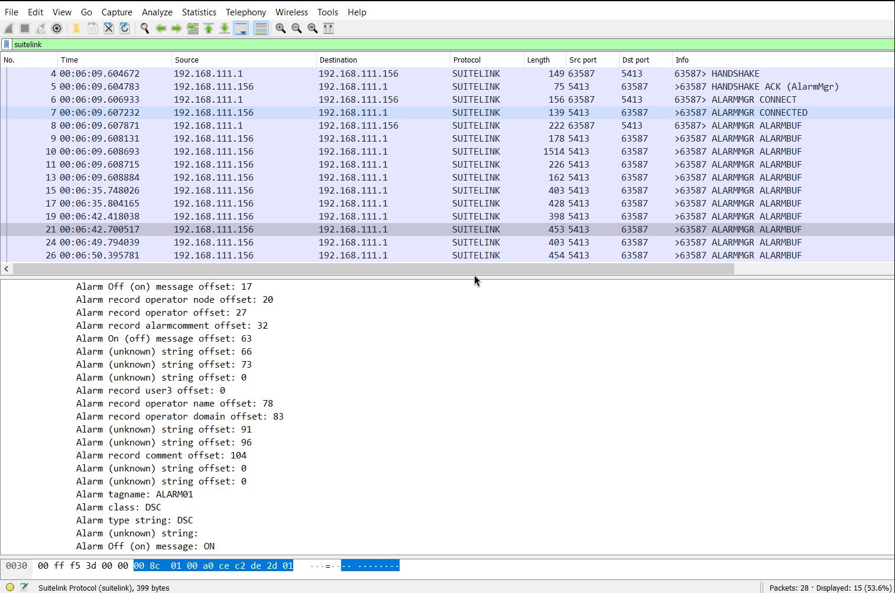

# A Wireshark dissector for Suitelink written in Lua
This is a partial Wireshark dissector the Suitelink protocol written in Lua. Suitelink is a proprietary protocol used by SCADA systems originally developed by Wonderware, and at the time of writing owned by AVEVA.

## Motivation and techniques
The original motivation for writing the dissector was to investigate a couple of issues with software using the protocol. This endeavour expanded far beyond what was originally intended, and the original issues are now mostly forgotten. When I started this project, the information available about the Suitelink protocol was that it used TCP port 5413, and little else. Through observing network traffic, reverse engineering software programs and libraries, I was able to piece together a decent (but certainly incomplete) understanding of how the protocol works. I am no longer particularly motivated in continuing to work on the reverse engineering of the protocol. But incomplete as the dissector may be, I will rather let it be forgotten here on the Internet than on my personal computer alone.

## Suitelink basics
There appears to be two distinct types of communication within the Suitelink protocol (that I have found). One is for data exchange, for instance updating the value of a temperature sensor. This communication type appears to be the more modern of the two. The other type is for handling alarm and event type of data, as commonly used in SCADA systems. This communication type is hereby referred to as AlarmMgr (Alarm Manager) and is by far more arcane. By observing the network traffic, it is also clear that not all e.g. data change communication goes through the Suitelink protocol. At least not through port 5413. But to the best of my knowledge, all communication is initiated through that port.

The data exchange communication has a payload starting with a two byte message (remaining) length field, followed by a two byte message type field, and the messages ends with the byte 0xa5. The AlarmMgr messages have a length field of variable length. In case the first byte is non-zero, that specifies the message remaining length. In case the first byte (only) is zero, then the following two bytes define the message remaining length. In case the three first bytes are zero, the following four bytes define the remaining message length. There is also a special message that may be used in the beginning of the communication, which has no length field, but an implied length of 48 bytes.

## Usage
The only file needed for Wireshark is suitelink.lua. Wireshark documentation will how this can be used. However, for my particular version of Wireshark, the suitelink.lua file can simply be copied to the plugins directory under the Wireshark installation folder. Then simply start capturing or open up a capture file, and Suitelink message should be detected and decoded. A capture of the communication in the following section is visible in the screenshot (the message when the ALARM01 alarm is turned on is shown).


## Alarm monitor
A small python program for monitoring alarms is included in the almmon.py file. The output of the program can look like below when running a small InTouch program, which first turns on ALARM01, then acknowledges all alarms, and lastly turns of ALARM01. There is much more information that could be displayed, and much of those fields are visible if the communication is monitored with Wireshark and the plugin provided here.

```
Connecting
Sending handshake
Waiting for handshake ACK
Sending connect
Waiting for connect ACK
Received bufNum: 0x00000000 and lpAcc: 0x00002231
Sending query
Waiting for updates
SUB   2024-12-07 17:56:20.475    2024-12-07 17:56:20.475   $Operator
SUB   2024-12-07 17:56:20.547    2024-12-07 17:56:20.547   $OperatorDomain
SUB   2024-12-07 17:56:20.547    2024-12-07 17:56:20.547   $OperatorName
SUB   2024-12-07 17:56:20.635    2024-12-07 17:56:20.635   $LogicRunning
SUB   2024-12-07 17:56:36.606    2024-12-07 17:56:36.606   $NewAlarm
ALM   2024-12-07 17:56:36.606    2024-12-07 17:56:36.606   ALARM01
SUB   2024-12-07 17:56:44.333    2024-12-07 17:56:44.333   $System.Ack
ACK   2024-12-07 17:56:44.333    2024-12-07 17:56:36.606   ALARM01
SUB   2024-12-07 17:56:52.661    2024-12-07 17:56:52.661   $NewAlarm
RTN   2024-12-07 17:56:52.661    2024-12-07 17:56:36.606   ALARM01
```

## Disclaimer
Trying to reverse the Suitelink protocol, my focus was on the dissector immediately aiding in this process, rather than on producing a stable and fault-tolerant dissector. And it shows. There are next to none checks about the validity and (sufficient) length of almost any of the message data in the dissector. Still, I have used the dissector in a variety of scenarios and it does work decently well. As there is basically only one player/supplier using this protocol, the risk of malformed packets should be lower than for most other protocols.
